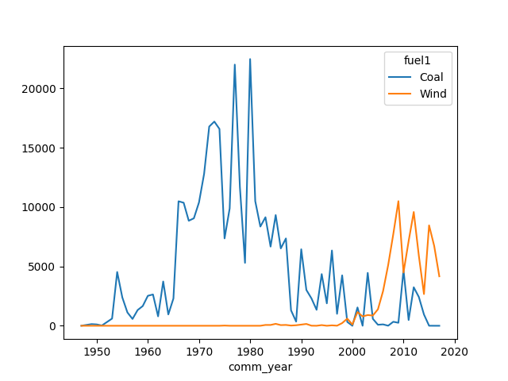

# dask-ee

Google Earth Engine `FeatureCollection`s via Dask DataFrames

## How to use

Install with pip:
```shell
pip install --upgrade dask-ee
```

Then, authenticate Earth Engine:
```shell
earthengine authenticate --quiet
```

In your Python environment, you may now import the library:

```python
import ee
import dask_ee
```

You'll need to initialize Earth Engine before working with data:
```python
ee.Initialize()
```

From here, you can read Earth Engine FeatureCollections like they are DataFrames:
```python
ddf = dask_ee.read_ee("WRI/GPPD/power_plants")
ddf.head()
```
These work like Pandas DataFrames, but they are lazily evaluated via [Dask](https://dask.org/).

Feel free to do any analysis you wish. For example:
```python
# Thanks @aazuspan, https://www.aazuspan.dev/blog/dask_featurecollection
(
    ddf[ddf.comm_year.gt(1940) & ddf.country.eq("USA") & ddf.fuel1.isin(["Coal", "Wind"])]
    .astype({"comm_year": int})
    .drop(columns=["geo"])
    .groupby(["comm_year", "fuel1"])
    .agg({"capacitymw": "sum"})
    .reset_index()
    .sort_values(by=["comm_year"])
    .compute(scheduler="threads")
    .pivot_table(index="comm_year", columns="fuel1", values="capacitymw", fill_value=0)
    .plot()
)
```


There are a few other useful things you can do. 

For one, you may pass in a pre-processed `ee.FeatureCollection`. This allows full utilization
of the Earth Engine API.

```python
import dask_ee

fc = (
  ee.FeatureCollection("WRI/GPPD/power_plants")
  .filter(ee.Filter.gt("comm_year", 1940))
  .filter(ee.Filter.eq("country", "USA"))
)
ddf = dask_ee.read_ee(fc)
```

In addition, you may change the `chunksize`, which controls how many rows are included in each
Dask partition.
```python
ddf = dask_ee.read_ee("WRI/GPPD/power_plants", chunksize=7_000)
ddf.head()
```

## License
```
Copyright 2024 Alexander S Merose

Licensed under the Apache License, Version 2.0 (the "License");
you may not use this file except in compliance with the License.
You may obtain a copy of the License at

    https://www.apache.org/licenses/LICENSE-2.0

Unless required by applicable law or agreed to in writing, software
distributed under the License is distributed on an "AS IS" BASIS,
WITHOUT WARRANTIES OR CONDITIONS OF ANY KIND, either express or implied.
See the License for the specific language governing permissions and
limitations under the License.
```

Some sources are re-distributed from Google LLC via https://github.com/google/Xee (also Apache-2.0 License) with and
without modification. These files are subject to the original copyright; they include the original license header
comment as well as a note to indicate modifications (when appropriate).
